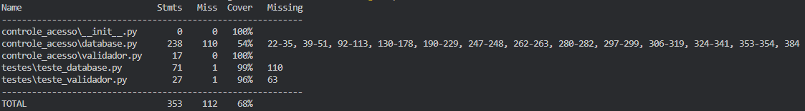

# Documentação de Testes de Unidade - MVP Controle de Acesso

## Objetivo
Este documento detalha os testes de unidade desenvolvidos para as classe principais do MVP (`ValidadorAcesso` e `BancoDeDados`). O objetivo é garantir que as regras de negócio referentes à autorização de entrada, manipulação dos usuários, perfis e zonas e, por fim, o registro imutável de logs funcionem conforme os requisitos, atingindo uma cobertura de código superior aos 60% exigidos.

## Estratégia de Teste Aplicada
Para garantir que os testes fossem isolados, rápidos e não dependessem do estado do servidor MySQL, utilizamos a técnica de **Injeção de Dependência**. A classe `ValidadorAcesso` não instancia o banco de dados diretamente; ela o recebe como parâmetro. 

Com isso, utilizamos a biblioteca `unittest.mock` (especificamente o `MagicMock`) para criar um "banco de dados falso". Isso nos permitiu simular diferentes retornos do banco e focar exclusivamente em testar a lógica de decisão do validador.

## Cenários de Teste Implementados
Foram desenvolvidos três casos de teste principais para validar as regras de acesso:

* **Acesso Permitido dentro do Horário:** Valida se o sistema autoriza um usuário válido cuja tag está cadastrada e a tentativa ocorre dentro da janela de horário permitida pela regra da zona.
* **Acesso Negado por Tag Desconhecida:** Simula uma tentativa de invasão com um cartão não cadastrado. Valida se o sistema bloqueia o acesso e se registra a tentativa falha usando o número da tag desconhecida para fins de auditoria.
* **Acesso Negado Fora do Horário:** Simula um usuário válido tentando entrar em uma zona fora do seu horário de permissão. Valida se o sistema bloqueia corretamente a porta com a mensagem de restrição temporal.
* **Operações de Banco de Dados (CRUD):** Utilizando o decorador @patch, interceptamos a conexão com o MySQL para simular falhas de integridade e sucessos nas operações de cadastro, listagem e remoção, validando a classe BancoDeDados sem afetar tabelas reais.

## Como os testes foram executados
Para reproduzir os testes localmente e verificar a cobertura do código, utilizamos a biblioteca `coverage`. No terminal, a partir da raiz do projeto, execute os seguintes comandos:

Execute os testes apontando para a pasta dedicada de testes:
```bash
coverage run -m unittest discover -s testes
```
Gere o relatório de cobertura no terminal:

```bash
coverage report -m
```

Com isso, todos os fluxos condicionais (if/else) das regras de negócio foram validados, e a cobertura global exigida foi superada, conforme ilustrado no relatório abaixo:


