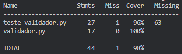

# Documentação de Testes de Unidade - MVP Controle de Acesso

## Objetivo
Este documento detalha os testes de unidade desenvolvidos para a classe principal do MVP (`ValidadorAcesso`). O objetivo é garantir que as regras de negócio referentes à autorização de entrada (User Story 1) e ao registro imutável de logs (User Story 3) funcionem conforme os requisitos, atingindo uma cobertura de código superior aos 60% exigidos na Sprint 2.

## Estratégia de Teste Aplicada
Para garantir que os testes fossem isolados, rápidos e não dependessem do estado do servidor MySQL, utilizamos a técnica de **Injeção de Dependência**. A classe `ValidadorAcesso` não instancia o banco de dados diretamente; ela o recebe como parâmetro. 

Com isso, utilizamos a biblioteca `unittest.mock` (especificamente o `MagicMock`) para criar um "banco de dados falso". Isso nos permitiu simular diferentes retornos do banco e focar exclusivamente em testar a lógica de decisão do validador.

## Cenários de Teste Implementados
Foram desenvolvidos três casos de teste principais para validar as regras de acesso:

* **Acesso Permitido dentro do Horário:** Valida se o sistema autoriza um usuário válido cuja tag está cadastrada e a tentativa ocorre dentro da janela de horário permitida pela regra da zona.
* **Acesso Negado por Tag Desconhecida:** Simula uma tentativa de invasão com um cartão não cadastrado. Valida se o sistema bloqueia o acesso e se registra a tentativa falha usando o número da tag desconhecida para fins de auditoria.
* **Acesso Negado Fora do Horário:** Simula um usuário válido tentando entrar em uma zona fora do seu horário de permissão. Valida se o sistema bloqueia corretamente a porta com a mensagem de restrição temporal.

## Cobertura de Código (Coverage)
Utilizamos a ferramenta `coverage` para medir a abrangência dos nossos testes. Todos os fluxos condicionais (`if/else`) da classe `ValidadorAcesso` foram alcançados pela suíte de testes.

O resultado obtido atendeu plenamente o critério de sucesso da Sprint, com a cobertura da classe principal atingindo o valor documentado abaixo:

