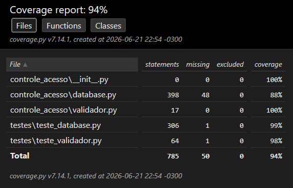

# Documentação de Testes de Unidade - MVP Controle de Acesso

## Objetivo
Este documento detalha os testes de unidade desenvolvidos para as classe principais do MVP (`ValidadorAcesso` e `BancoDeDados`). O objetivo é garantir que as regras de negócio referentes à autorização de entrada, manipulação dos usuários, perfis e zonas e, por fim, o registro imutável de logs funcionem conforme os requisitos, atingindo uma cobertura de código superior aos 60% exigidos.

## Estratégia de Teste Aplicada
Para garantir que os testes fossem isolados, rápidos e não dependessem do estado do servidor MySQL, utilizamos a técnica de **Injeção de Dependência**. A classe `ValidadorAcesso` não instancia o banco de dados diretamente; ela o recebe como parâmetro. 

Com isso, utilizamos a biblioteca `unittest.mock` (especificamente o `MagicMock`) para criar um "banco de dados falso". Isso nos permitiu simular diferentes retornos do banco e focar exclusivamente em testar a lógica de decisão do validador.

## Cenários de Teste Implementados

Foram desenvolvidos testes de unidade para validar tanto as regras de negócio do sistema quanto as operações principais da camada de banco de dados:

* **Acesso Permitido dentro do Horário:** Valida se o sistema autoriza corretamente um usuário com tag RFID cadastrada, permissão para a zona solicitada e tentativa realizada dentro da janela de horário permitida. Também verifica se o log é registrado como `PERMITIDO`.
* **Acesso Negado por Tag Desconhecida ou Sem Permissão:** Simula uma tentativa de acesso em que a tag RFID não possui permissão para a zona informada. Valida se o acesso é negado e se a tentativa é registrada na auditoria com o motivo adequado.
* **Acesso Negado Fora do Horário:** Simula um usuário válido tentando acessar uma zona fora do horário permitido. Valida se o sistema bloqueia o acesso e registra o log como `NEGADO`, com motivo relacionado à restrição de horário.
* **Casos de Borda da Janela de Horário:** Valida tentativas realizadas exatamente no horário inicial e final permitido, garantindo que esses limites sejam aceitos. Também testa acessos imediatamente antes do horário inicial e após o horário final, que devem ser negados.
* **Formato de Horário Inválido:** Verifica se o sistema trata corretamente entradas de horário em formato inválido, impedindo a execução da validação e evitando o registro incorreto de logs.
* **Operações de Usuários:** Testa o cadastro, atualização de tag RFID, remoção, listagem com filtros e contagem paginada de usuários. Também valida buscas por nome e buscas utilizadas no autocomplete do simulador, incluindo RFID e perfil.
* **Operações de Perfis e Zonas:** Testa a listagem, cadastro e remoção de perfis e zonas. Também são verificados cenários de erro, como nomes vazios, duplicidade e tentativa de remoção de registros vinculados a usuários, regras ou logs.
* **Operações de Regras de Acesso:** Valida a criação e atualização de regras de acesso, além da listagem e contagem com filtros por perfil, zona e intervalo de horário.
* **Operações de Logs e Auditoria:** Testa o registro de logs, a busca dos últimos acessos, a filtragem de logs por usuário, zona, resultado e datas, além da contagem usada na paginação da página de auditoria.
* **Métricas do Dashboard:** Valida as funções responsáveis por retornar totais de usuários, perfis, zonas e acessos permitidos ou negados no dia atual.
* **Operações de Banco de Dados com Mock:** Utilizando o decorador `@patch`, a conexão real com o MySQL é interceptada. Assim, os testes simulam sucessos, falhas de banco e erros de integridade sem alterar tabelas reais.

## Como os testes foram executados
Para reproduzir os testes localmente e verificar a cobertura do código, utilizamos a biblioteca `coverage`. No terminal, a partir da raiz do projeto, execute os seguintes comandos:

Execute os testes apontando para a pasta dedicada de testes:
```bash
coverage run -m unittest discover -s testes
```
Gere o relatório de cobertura no terminal:

```bash
coverage report -m
```

Com isso, todos os fluxos condicionais (if/else) das regras de negócio foram validados, e a cobertura global exigida foi superada, conforme ilustrado no relatório abaixo:



